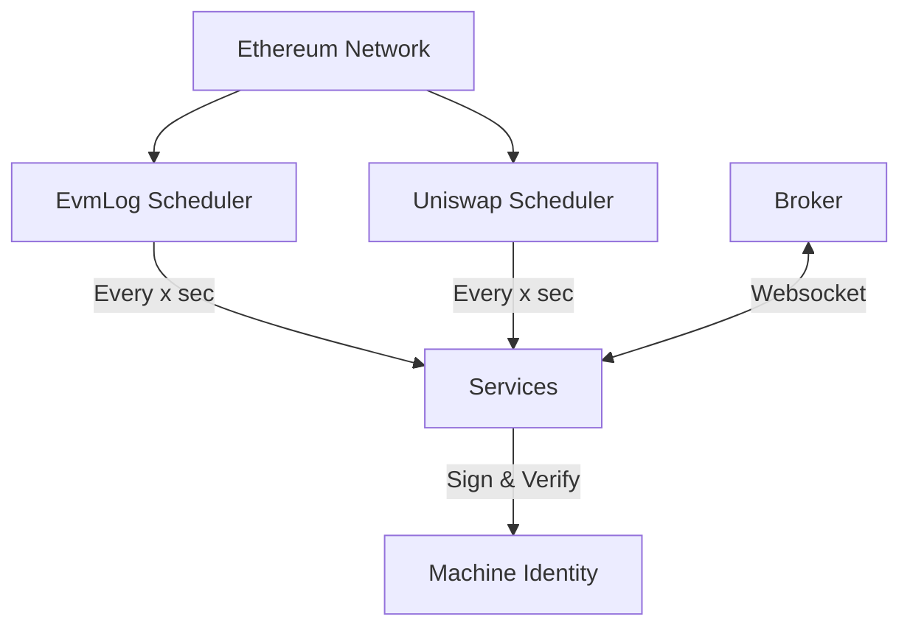

# Developer Guide

This article is a guide for developers who want to contribute to the Unchained project. The project is written in Go and we are open to all new suggestions and ideas, so keeping the codes clean and efficient is really important.

## Conventions

We follow the practices which is recommended by golang documents as [Effective Golang](https://go.dev/doc/effective_go) actually with some modifications. But its better to read it and follow the rules. Most of the important ones are covered in our linters, so if you need to check your codes, you can use the following command:

```bash
golangci-lint run --fix 
```
It will fix correctable issues and show the rest of them.

## Development Environment

The project is not depends on a specific IDE or special tools, but some tools are necessary to be installed on your machine to run the project:

- Go: The project is written in Go, so you need to install Go on your machine. You can download it from [here](https://golang.org/dl/).
- Docker: The project uses docker to run the services on production mode, if you need to test and run project on docker, so you need to install docker on your machine. You can download it from [here](https://docs.docker.com/get-docker/).
- Golang linter: The project uses golangci-lint to lint the codes and check the best practices. You can install it from [here](https://golangci-lint.run/welcome/install/).
- Other: for other tools and contribution ways please refer to the [CONTRIBUTING.md](CONTRIBUTING.md) doc.

## Project Structure

The Project follows the Clean Architecture pattern. The project is divided into the following layers:

- Services: This layer contains the business logic of the application.
- Repository: This layer contains the data access logic of the application which can be implemented for postgres, mongodb, etc.
- Handler: This layer contains the adapters for websocket packet processing.

and the layout is inspired by this [repository](https://github.com/evrone/go-clean-template), also with some modifications.

## Concepts

### Federated Network

The Unchained network is a federated network that consists of three types of nodes: Broker, Worker, and Consumer. Anyone can run a new node and help the network to process the load and requests.

#### Broker

The broker nodes are responsible for managing the network and routing the data to the correct worker and consumer nodes. The clients of brokers consist of following:

- Consumers: They listen to the data from the brokers and save or use them.
- Workers: They process the data and send them the brokers.
- Clients: They request to run a rpc function.


#### Worker

The workers are the nodes that process the data and send them to the broker. The workers can be a service that listens to the data from the blockchain, or a service that listens to the data from the broker. These services hold different business logics and will provide different services to the network.


#### Consumer

The consumers are the nodes that listen to the data from the broker and save or use them. These data be saved in a database, or be served to the users by an API.


### Identity and Security

In a network like Unchained we send and receive many data from other parties and we need to identify and validate the data sender. in other hand, we communicate with different blockchains and every node needs to keep the keys and addresses of the blockchain.

These keys are hold on a global machine identity and will used once the node wants to sign a message or verify a message.

### BLS

A BLS digital signature, also known as Boneh–Lynn–Shacham (BLS), is a cryptographic signature scheme which allows a user to verify that a signer is authentic. The scheme uses a bilinear pairing for verification, and signatures are elements of an elliptic curve group.

### Ethereum

A Key pair of private and public keys which represent the identity of the node in the Ethereum network. and address of smart contract which is used to sync the nodes together.